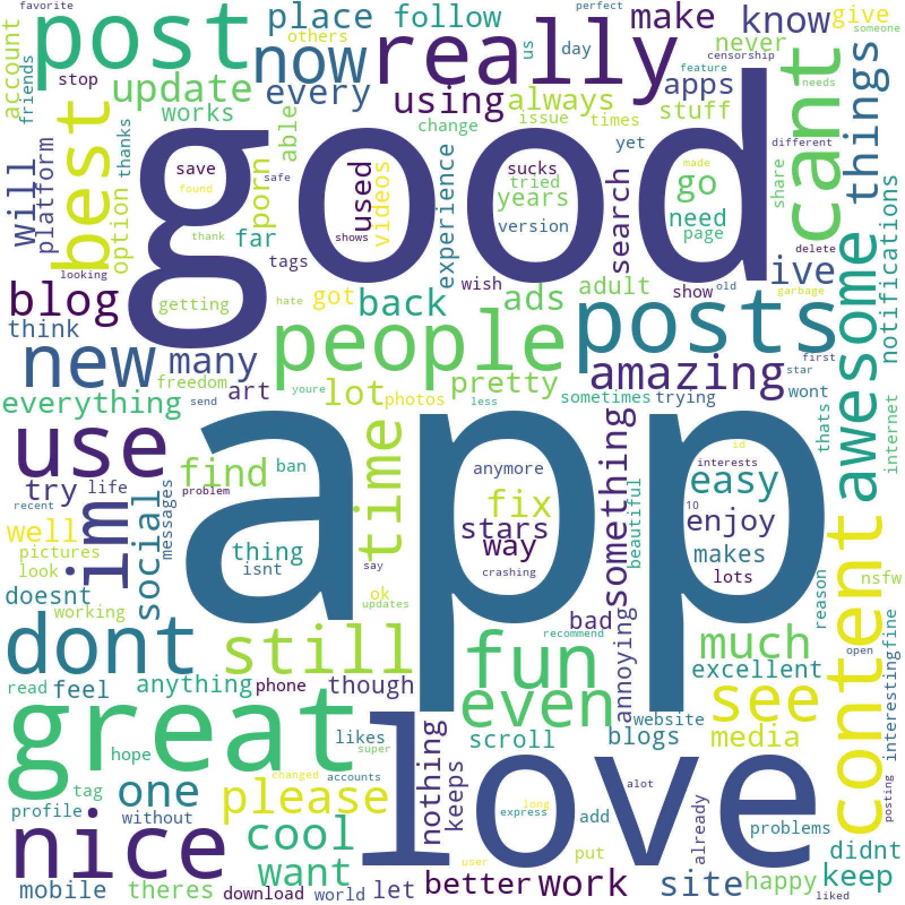

# ReviewCloud
Python script that generates a word cloud using your app's reviews report from Google Play Developer console. Allows filtering by review language.

Reports can be found in the Google Play Developer console, User feedback section and Reviews. The format available is `.csv` and thats exactly what you need.

## Instalation

To install dependencies needed run:

    pip3 install -r requirements.txt

## Usage

The following parameters are shown when `--help` is entered.

```
usage: reviewcloud.py [-h] -rp REPORT_PATH [-lang LANGUAGE] [-out OUTPUT]
                      [-uniq]

Script to generate a word cloud from a Play Store review report (.csv)

optional arguments:
  -h, --help            show this help message and exit

  -rp REPORT_PATH, --report-path REPORT_PATH
                        Path where the comma separated report (.csv) is located

  -lang LANGUAGE, --language LANGUAGE
                        Optional. Language code to filter reviews (i.e "en",
                        "es"...)

  -out OUTPUT, --output OUTPUT
                        Optional. Path to the file where to save word cloud

  -uniq, --unique       Optional. Use high frequency unique words. If omitted it uses
                        high frequency words ignoring singular/plurals (i.e
                        "car" and "cars" count as same word)
```

Example of usage:

```
python3 reviewcloud.py \
	-rp /path/to/report/reviews_company_202007.csv \
	-lang "en" \
	-uniq
```

## Example of word cloud

Example of word cloud filtering by english and unique words



## Credits

Big thanks to the great [word_cloud](https://github.com/amueller/word_cloud) library for making this way easier that I expected
